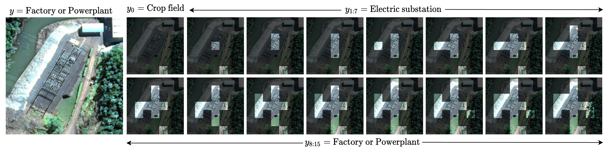
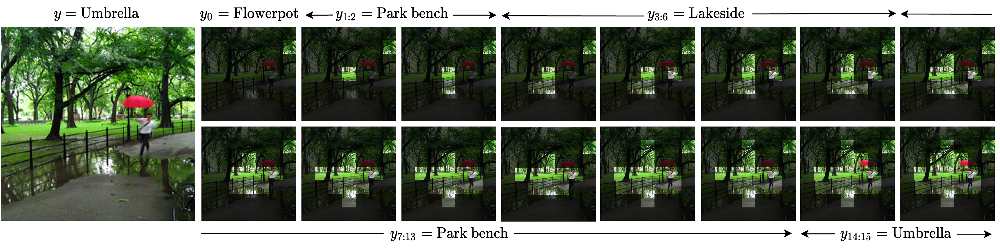

# Consistency driven Sequential Transformers Attention Model for Partially Observable Scenes
**Authors**: Samrudhdhi Rangrej, Chetan Srinidhi, James Clark
**Accepted to**: CVPR'22
&nbsp;

&nbsp;

&nbsp;

An overview of our *Sequential Transformers Attention Model* **(STAM)**. The STAM consists of a core *T*, classifiers *G* and *D*, an actor *A*, and a critic *C* (only used during training). Each training iteration consists of three steps: **Step 1** (green path): Given a complete image *X*, the teacher model predicts a soft pseudo-label *q(y|X)*. **Step 2** (blue path): Given glimpses *g0:t*, STAM predicts class distributions *pg(yt|fgt)* and *pd(yt|fdt)*, value *V(st)*, and attention policy *&pi;(lt+1|st)*. **Step 3** (orange path): An additional glimpse is sensed. Step 2 is repeated using all glimpses (including the additional glimpse) and the losses are computed. The model parameters are updated using the gradients from Step 2.

## Requirements
* torch==1.8.1
* torchvision==0.9.1
* tensorboard==2.5.0
* timm==0.4.9
* fire==0.4.0

## Datasets
* [ImageNet](https://www.image-net.org/)
* [fMoW](https://github.com/fMoW/dataset) (Download and prepare the dataset following the instructions provided in [PatchDrop](https://github.com/ermongroup/PatchDrop) repository)

## Visualization

Visualization of glimpses selected by STAM on example images from *t=0* to *15*. (top) ImageNet; (bottom) fMoW. Complete images are shown for reference only. STAM does not observe a complete image.

## Acknowledgement
Our code is based on [deit](https://github.com/facebookresearch/deit).
